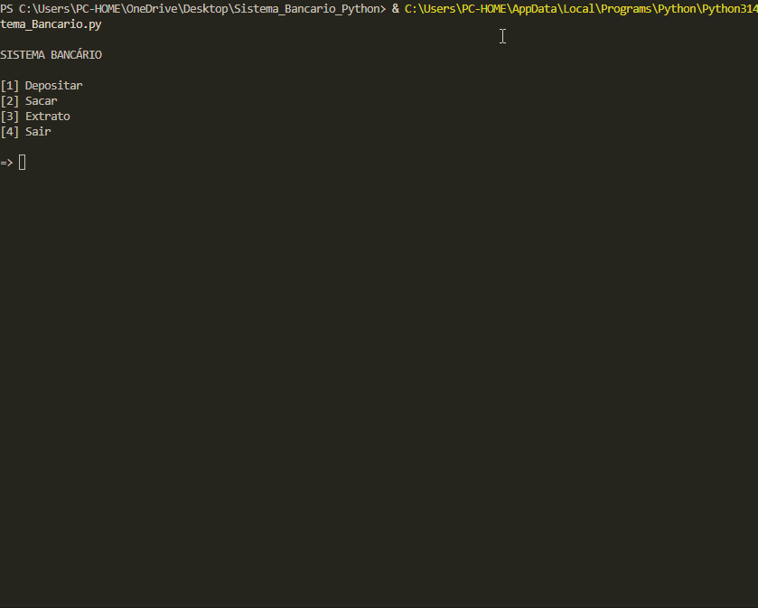

# 🏦 Sistema Bancário em Python

# OBJETIVO:
🎯 Desenvolver um sistema que simula o fluxo financeiro de uma conta bancária. O sistema visa gerenciar as operações principais de um sistema bancário.

# :hammer: Funcionalidades do projeto 
- Funcionalidade 1: Depósito. Realiza depósitos de acordo com o valor desejado pelo usuário.
- Funcionalidade 2: Saque. Realiza saques de acordo com o valor desejado pelo usuário. O saque é debitado da conta. 
- Funcionalidade 3: Extrato. Visualização do extrato com todas as movimentações realizas (depósitos e saques), detalhando o valor e ordem. Exemplo: 1° depósito R$ 250,00. 

PORQUE ELABOREI ESSE PROJETO
    Comecei o Bootcamp Santander Banck End Pyhton e desenvolvi este projeto para consolidar os meus conhecimentos em lógica de programação, estruturas de repetição e manipulação de dados em Python, visando demonstrar meus conhecimentos, aprendendo durante o processo de construção e buscando uma primeira oportunidade de **Estágio em Desenvolvimento de Software**.

---
## Pré requisitos para utilizar o sistema
    Python 3
    Vs CODE ou outro editor de código.
    Obs:Não é necessário instalar nenhuma biblioteca.

## 🛠️ Tecnologias e Conceitos Aplicados

* **Python 3** (Linguagem principal)
* **VS Code** (Editor de código)

* **Estruturas Condicionais e Repetição** (`if`, `elif`, `else`, `while`, `for`)
* **Manipulação de Variáveis e Tipos de Dados** (Listas, Dicionários, Floats)
* **Validação de Dados** (Garantir que o utilizador não levanta mais do que o saldo ou insere valores negativos)

---

## 📈 O Que Aprendi com Este Projeto 

    1. **Regras de Negócio Estritas:** Implementar o limite de 3 levantamentos diários e o valor máximo de R$ 500 por operação. 

    2. **Tratamento de Erros:** Garantir que o sistema não falhe se o utilizador tentar levantar um valor maior do que o saldo disponível. Garantir que caso o usuário digite um valor menor ou igual a zero o sistema peça para digitar um valor válido. 
    3. **Limpeza de Código:** Organizar o menu de forma a que a experiência do utilizador no terminal seja fluida e intuitiva. Organizar a estrutura do código para que fique legível, utilizando boas práticas para nomear as variáveis, permitindo assim uma leitura mais compreensível para outros colegas de trabalho. 
    4. **Estrutura de Dados** 
        Aprendi a criar um dicionário de listas.
        Aprendi a acessar listas dentro de um dicionario. Utilizei a estrutura de repetição `for`, utilizando chaves, índices e estruturas condicionais para acessar e exibir na tela o conteúdo desejado de forma formatada usando uma f string. 

## Desafios enfrentados
    1. Pensamento Computacional. Pensar em como posso quebrar o problema maior em várias partes pequenas e transformar isso em código usando a lógica de programação. 
    2. Criar as restrições necessárias dentro do algoritmo: estabelecer critérios de entrada para os valores de depósito e saque (impedir valores negativos ou iguais a zero por exemplo). Dessa forma, foi atendido os requisitos de acordo com o negócio real. 

---

## 🚀 Como Executar o Projeto
    Como executar o sistema de banco no seu computador.
    Siga os passos abaixo para rodar o projeto localmente:
    Faça o Fork deste repositório clicando no botão Fork no canto superior direito da página geral do reposítório.

    COMANDOS NO GIT
    Abra o terminal do git do seu computador e clone o seu fork:
    git clone link-do-fork

    Entre na pasta do projeto que foi criada:
    cd nome-do-repositorio

    Abra o projeto no VS Code:
    Code.

    NO VS CODE
    Execute o sistema de banco:
    Abra o terminal do VS Code e digite o comando para rodar o script principal: nome_do_arquivo.py

    (Caso esteja no Mac/Linux e o comando acima não funcione, tente usar python3 nome_do_arquivo.py).

## Explicação do algoritmo passo a passo
[clique aqui:](docs/explicacao_do_codigo.md)

---
## 📝 Licença

Este projeto está sob a licença [MIT](LICENSE).
[LinkedIn:](https://www.linkedin.com/in/dieldev/)
[Email:](gidieldev@gmail.com)

