# EXPLICAÇÃO DO CÓDIGO

Primeiramente criei 3 variáveis compostas:
um dicionário para o extrato, uma lista para os depósitos e outra para os saques.
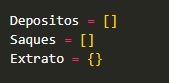
Criei variáveis simples:
uma variável contabiliza a quantidade de saques
uma variável saque limite (que deve ser igual a 3)
variável opção que será qual operação o usuário deseja realizar
variável menu onde exibirá o menu formatado na tela

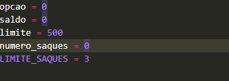

# Inicio do programa
Começamos com uma estrutura de repetição while True que só termina com o comando break (opção 4)

aparecerá um menu na tela para que o usuário digite a opção que deseja
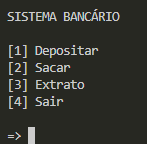
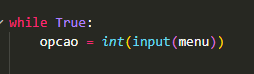

# Se o usuário digitar 1 o sistema entra na opção de deposito
Pergunta quanto ele deseja sacar.
o programa verifica se esse valor é valido
a estrutura while mantem o programa informando que o valor digitado é inválido até o usuário digitar um valor correto.

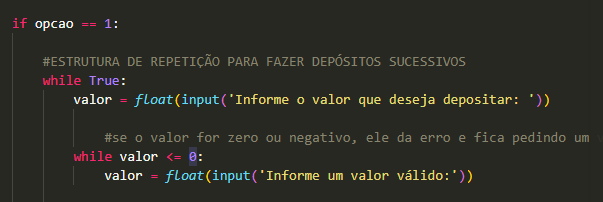

Se estiver tudo certo, o valor entra na lista de depósitos, o saldo recebe o valor, é exibido na tela o valor que foi depositado e pergunta se ele deseja sacar novamente.
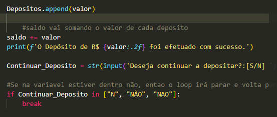

# Se o usuário digitar 2 o sistema entrará na opção de sacar. 
Ele verificará se todos os requisitos estão de acordo para permitir o saque.
RESTRIÇÕES que o sistema verifica:
    Se o valor de saque não é maior do que o saldo da conta
    Se o valor não é maior do que o limite de R$500 por saque 
    Se o valor de saque não é igual ou menor que zero
    E se a quantidade de saques é menor do que 3, que é o limite diário.

Caso tudo certo, o sistema libera o saque, descontando do saldo e contabilizando a quantidade de saques realizados até o momento.

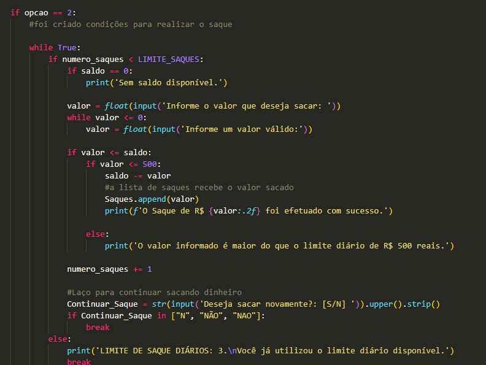

# Se o usuário digitar 3 o sistema entrará na opção extrato.
O extrato é um dicionário onde terá três chaves: uma para armazenar os depósitos, outra para saques e a última para informar o saldo final após todas as movimentações.

EXIBIÇÃO DO EXTRATO
criamos uma estrutura de repetição `for` para exibir na tela o conteúdo do extrato.
a "Tipo_Movimentacao" será a representação da posição dentro do dicionário e Lista_Valores será a representação do valor contido dentro das repectivas listas.
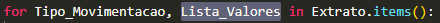

A estrutura condicional `if` foi utilizada para exibir na tela de forma personalizada para cada lista (depósitos e saques)
Caso for deposito, ira exibir na tela a posição e o valor de cada deposito. 
Caso for saque, ira exibir na tela a posição e o valor de cada saque. 
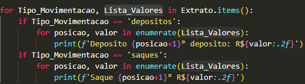

fora da estrutura foi exibido o valor do saldo 
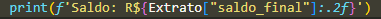

# Caso o usuário digitar a opção 4 (Opção para sair do programa)
O sistema ativará o comando `break` que sairá da estrutura de repetição `while` e exibirá na tela uma mensagem informando que o sistema foi encerrado.
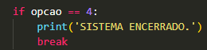